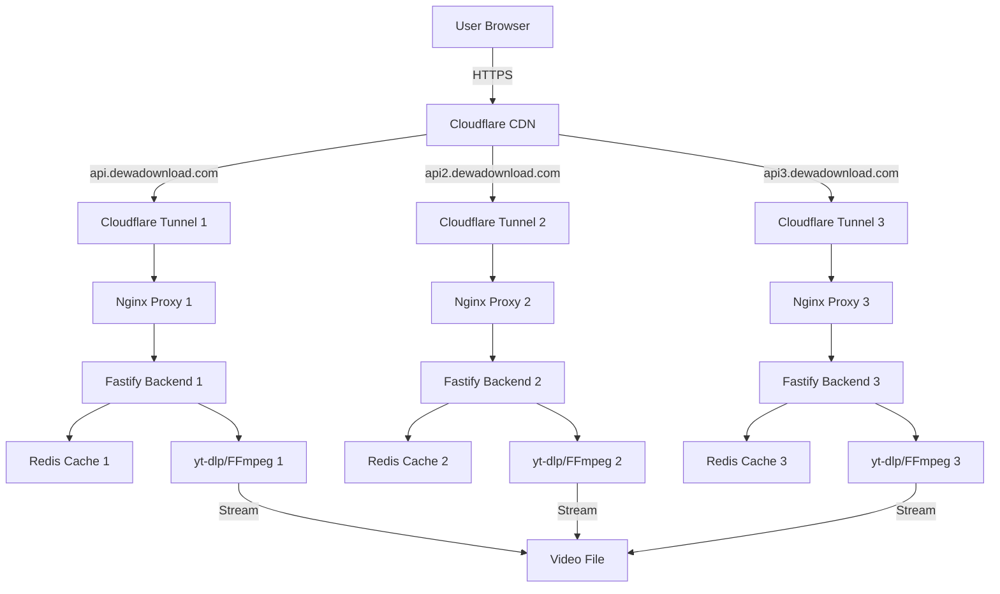
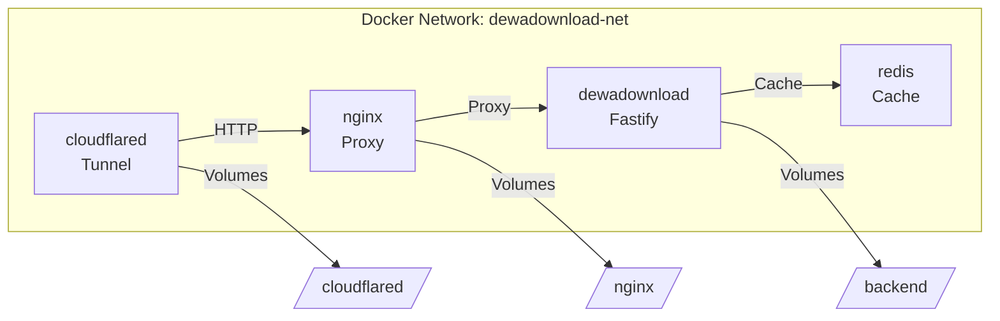

# DewaDownload Architecture Illustrations

This directory contains diagrams and visualizations for the blog post.

## Image List

### 1. architecture-overview.png
Shows the complete system architecture:
- User request flow
- Cloudflare CDN
- 3 subdomains (api, api2, api3)
- Cloudflare Tunnels
- Nginx reverse proxies
- Fastify backends
- Redis caching
- yt-dlp/FFmpeg processing

### 2. docker-architecture.png
Docker Compose service architecture:
- dewadownload container (Fastify backend)
- redis container (Caching)
- nginx container (Reverse proxy)
- cloudflared container (Tunnel)
- Network: dewadownload-net (bridge)
- Volume mounts for logs and configs

### 3. performance-chart.png
Performance comparison bar chart:
- Before: Info TTFB 9.4s → After: 1.6s (82% faster)
- Before: Download TTFB 4.6s → After: 1.8s (61% faster)
- Before: Download Speed 185 KB/s → After: 800 KB/s (4x faster)
- Before: Concurrent 1024 → After: 8192 (8x increase)

### 4. status-dashboard.png
Backend status dashboard showing:
- 3 backend nodes with health status
- Response time metrics
- Performance ratings
- Auto-refresh indicator

## Creating the Images

For actual deployment, you can create these images using:
- Mermaid diagrams (exported as PNG)
- Draw.io / diagrams.net
- Figma
- Excalidraw
- Or any diagramming tool

### Mermaid Example for Architecture Overview

### Mermaid Example for Docker Architecture

## Placeholder Images

For now, the blog post references these images. Replace them with actual PNG files before publishing.

Recommended image dimensions:
- Width: 1200px
- Height: 600-800px
- Format: PNG with transparency support
