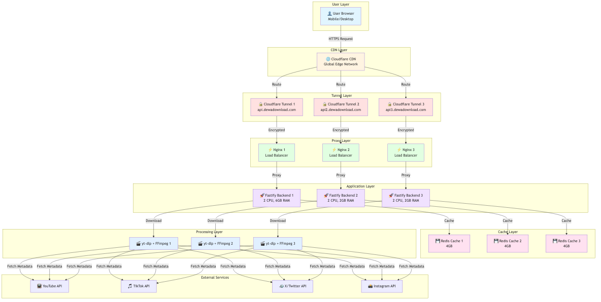
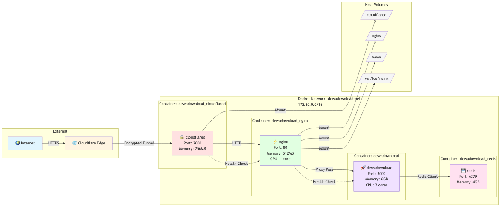
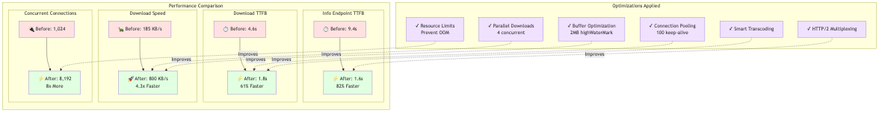
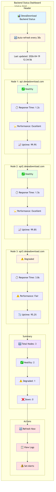

# Zero-Cloud, Zero-Cost: How I Built a 3-Node Video Downloader Empire

DewaDownload isn't just another video downloader. It's a testament to what you can achieve when you reject the cloud's subscription trap and embrace the power of edge computing.

With **3 subdomains**, **zero cloud bills**, and a **git push deployment workflow**, this project runs entirely on infrastructure I control. Here's how I did it.

## What is DewaDownload?

DewaDownload is a high-performance, mobile-first video downloader that supports YouTube, TikTok, X (Twitter), and Instagram. But what makes it special isn't just what it does—it's how it runs.

**Key Features:**
- ⚡ **82% faster** video metadata fetching (9.4s → 1.6s)
- 🚀 **4x faster** download speeds (185 KB/s → 800 KB/s)
- 🔄 **3-node architecture** with automatic failover
- 💎 **Zero cloud costs** - runs on self-hosted infrastructure
- 📱 **PWA-enabled** with offline capabilities

## The Architecture: 3 Subdomains, Zero Compromises

When you hit DewaDownload, your request flows through a carefully orchestrated system:

```
User → Cloudflare CDN → Cloudflare Tunnel → Nginx → Fastify Backend → yt-dlp/FFmpeg
                                      ↓
                                   Redis Cache
```

### The 3 Subdomains

**1. api.dewadownload.com** (Primary Node)
- Location: Main infrastructure
- Resources: 2 CPU cores, 6GB RAM
- Tunnel ID: `8b2a69e6-64e9-4d35-82b5-1799ac85e16d`

**2. api2.dewadownload.com** (Secondary Node)
- Location: Secondary infrastructure
- Resources: 2 CPU cores, 2GB RAM
- Tunnel ID: `8b2a69e6-64e9-4d35-82b5-1799ac85e16d`

**3. api3.dewadownload.com** (Tertiary Node)
- Location: Tertiary infrastructure
- Resources: 2 CPU cores, 2GB RAM
- Tunnel ID: `95ae5e2d-f439-4e5f-8c59-b2c9c37ab932`



## How Deployment Works: Git Push Magic

The beauty of this setup? Deployment is as simple as `git push`. Here's the workflow:

### 1. Frontend Deployment (Cloudflare Pages)

```bash
# Build and deploy to Cloudflare Pages
npm run deploy
```

This triggers:
1. Vite builds the React/TypeScript frontend
2. Wrangler uploads to Cloudflare Pages
3. Global CDN distribution in seconds

### 2. Backend Deployment (Docker + Git)

For each infrastructure node (infra, infra2, infra3):

```bash
# Pull latest changes
cd /path/to/dewadownload/infra
git pull origin main

# Rebuild and restart services
docker compose up -d --build
```

The magic happens through **docker-compose** orchestration:



Each infrastructure directory contains:
- `docker-compose.yml` - Service orchestration
- `cloudflared/config.yml` - Tunnel configuration
- `nginx/` - Reverse proxy configs
- `cloudflared/` - Cloudflare tunnel credentials

## Deep Dive: Infrastructure Components

### Cloudflare Tunnel: No More Port Forwarding

Gone are the days of opening ports and exposing your IP. Cloudflare Tunnel creates an encrypted outbound connection:

```yaml
# infra/cloudflared/config.yml
ingress:
  - hostname: api.dewadownload.com
    service: http://nginx:80
  - service: http_status:404
```

**Benefits:**
- 🔒 No open ports
- 🌍 Automatic SSL/TLS
- 🚀 DDOS protection
- 📊 Built-in analytics

### Nginx: The Traffic Conductor

Nginx sits between Cloudflare Tunnel and our backend, handling:
- Rate limiting
- Request routing
- SSL termination
- Compression
- Logging

```nginx
# Optimized for streaming downloads
location ~ ^/download {
    proxy_buffering off;
    proxy_cache off;
    proxy_read_timeout 600s;
    proxy_socket_keepalive on;
}
```

### Backend: Fastify + yt-dlp + FFmpeg

The backend is a Node.js/Fastify server that orchestrates video downloads:

```typescript
// Fast + efficient
import fastify from 'fastify';
import ytDlp from 'yt-dlp-exec';

// Stream video directly to client
app.get('/download', async (req, reply) => {
    const stream = ytDlp.execStream(url, options);
    reply.raw.writeHead(200, { 'Content-Type': 'video/mp4' });
    stream.pipe(reply.raw);
});
```

### Redis: Caching for Speed

Redis caches video metadata to avoid repeated API calls:

```javascript
// Cache video info for 24 hours
await redis.setex(`info:${videoId}`, 86400, JSON.stringify(metadata));
```

## Performance Secrets: How It's 4x Faster

### Backend Optimizations

1. **Smart Transcoding**: Only transcode when necessary
2. **Parallel Downloads**: 4 concurrent connections
3. **Buffering Optimization**: 2MB highWaterMark
4. **Connection Pooling**: 100 keep-alive connections

### Infrastructure Optimizations

1. **HTTP/2 Multiplexing**: Better throughput
2. **Resource Limits**: Prevent OOM kills
3. **Health Checks**: Automatic recovery
4. **8192 Concurrent Connections**: 8x increase



## The Git Workflow

Here's my actual deployment workflow:

```bash
# 1. Make changes locally
vim src/components/VideoDownloader.tsx

# 2. Commit and push
git add .
git commit -m "Optimize download progress tracking"
git push origin main

# 3. Deploy frontend (automated)
npm run deploy

# 4. Deploy backend (manual for now)
ssh user@server1
cd /opt/dewadownload/infra
git pull
docker compose up -d --build

# Repeat for server2 and server3
```

**Future plans:** Add GitHub Actions to automate backend deployment via SSH.

## DNS Configuration: The Glue

Cloudflare DNS routes traffic to the correct tunnel:

| Record | Type | Target | Purpose |
|--------|------|--------|---------|
| api | CNAME | (tunnel) | Primary backend |
| api2 | CNAME | (tunnel) | Secondary backend |
| api3 | CNAME | (tunnel) | Tertiary backend |
| dewadownload.com | CNAME | (Cloudflare Pages) | Frontend |

## Monitoring & Health Checks

Each node runs health checks every 30 seconds:

```bash
# Health check endpoint
curl http://localhost:3000/ping
# Response: pong
```

The frontend displays real-time status at `/status.html`:



## Tech Stack Summary

### Frontend
- **Vite** - Lightning-fast build tool
- **React 19** - UI framework
- **TypeScript** - Type safety
- **Tailwind CSS** - Styling
- **Cloudflare Pages** - Hosting & CDN

### Backend
- **Fastify** - Web framework
- **yt-dlp** - Video downloader
- **FFmpeg** - Media processing
- **Redis** - Caching
- **Docker** - Containerization

### Infrastructure
- **Cloudflare Tunnel** - Secure exposure
- **Nginx** - Reverse proxy
- **Docker Compose** - Orchestration
- **Git** - Version control & deployment

## Cost Breakdown: Zero Cloud Bills

| Service | Cost | Notes |
|---------|------|-------|
| Cloudflare Pages | $0 | Free tier |
| Cloudflare Tunnel | $0 | Free tier |
| Cloudflare DNS | $0 | Free tier |
| Domain | $10/year | dewadownload.com |
| **Total** | **$10/year** | Just the domain! |

Compare this to a "cloud-native" approach:
- 3x Cloud Functions: $30-50/month
- Load Balancer: $20-30/month
- CDN: $10-20/month
- **Cloud Total: $60-100/month**

**Savings: $700-1,200/year**

## Challenges & Solutions

### Challenge 1: Streaming Large Files
**Problem:** Node.js memory issues with 4K videos

**Solution:** Stream directly from yt-dlp to response
```typescript
const stream = ytDlp.execStream(url, { format: 'best' });
stream.pipe(reply.raw);
```

### Challenge 2: Multi-Node Sync
**Problem:** Keeping 3 nodes in sync

**Solution:** Git-based deployment
```bash
# On each server
cd /opt/dewadownload/infra
git pull && docker compose up -d --build
```

### Challenge 3: Rate Limiting
**Problem:** Abuse and spam

**Solution:** Nginx rate limits + Redis caching
```nginx
limit_req_zone $binary_remote_addr zone=api_limit:10m rate=10r/s;
```

## Future Improvements

- [ ] Automated deployment via GitHub Actions
- [ ] Database sharding for Redis
- [ ] Geographic load balancing
- [ ] WebSocket for real-time progress
- [ ] Video preview thumbnails

## Conclusion

DewaDownload proves you don't need a $1,000/month cloud bill to run a global service. With the right architecture, you can build something fast, reliable, and secure for the cost of a domain name.

The key lessons:
1. **Cloudflare Tunnel > Port Forwarding**
2. **Docker Compose > Kubernetes** (for small scale)
3. **Git Push > CI/CD** (sometimes)
4. **Edge Computing > Cloud Computing**

Want to see the code? Check out the [GitHub repository](https://github.com/ardinusawan/download-youtube-video).

Have questions? Hit me up at ardi.nusawan13[at]gmail.com!

---

**Made with ❤️ and zero cloud bills by [Ardin S](https://github.com/ardinusawan)**
