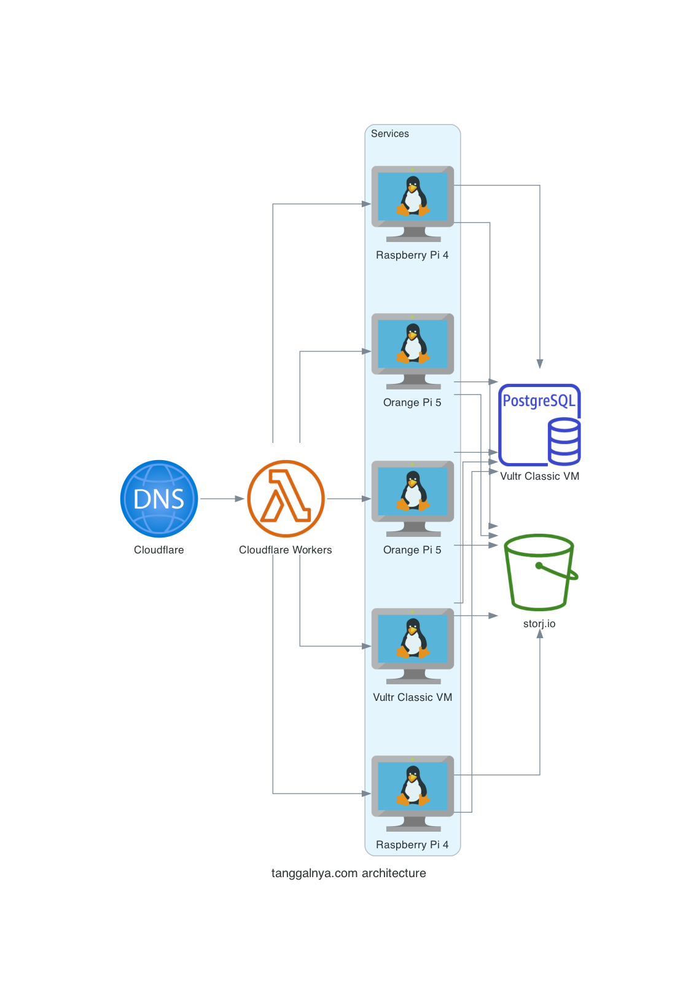
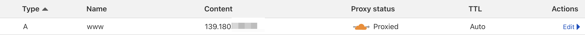
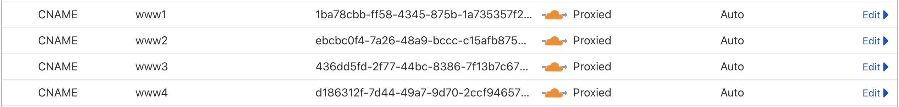
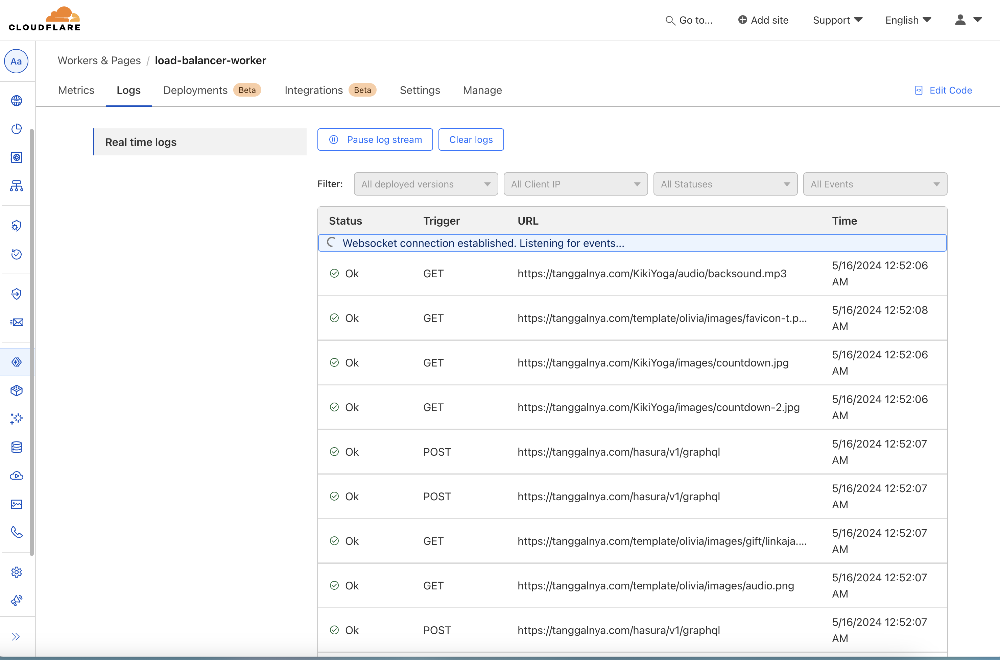
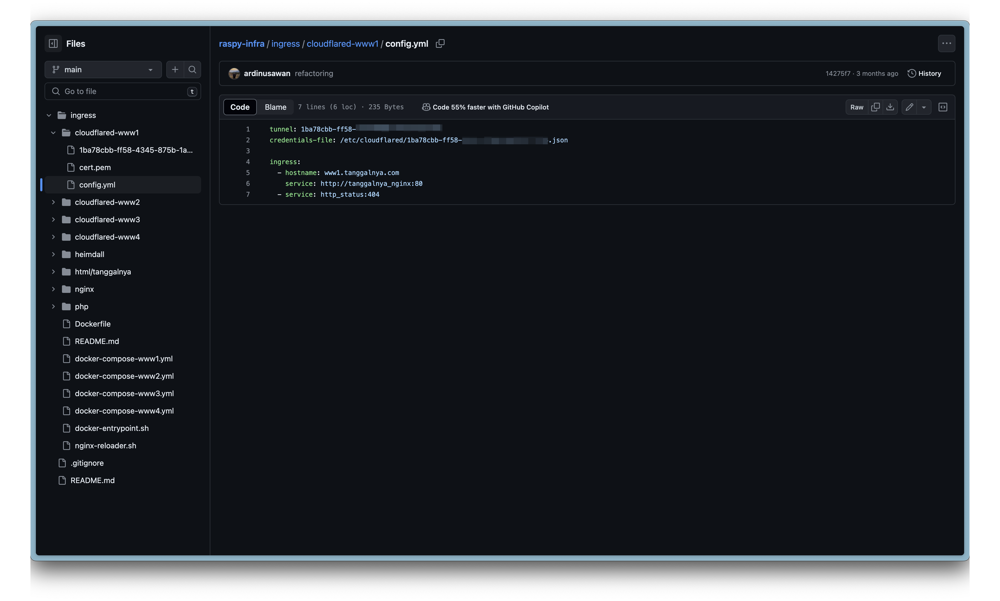
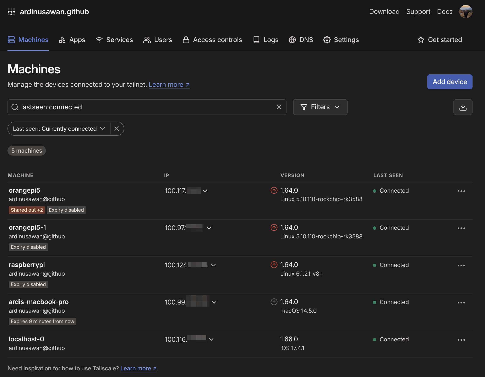

# Pendahuluan

Jika kamu mengakses https://tanggalnya.com, permintaanmu akan diarahkan ke salah satu domain ini
- https://www.tanggalnya.com
- https://www1.tanggalnya.com
- https://www2.tanggalnya.com
- https://www3.tanggalnya.com
- https://www4.tanggalnya.com

Kecuali www, yang lain diarahkan ke raspy / orange pi di rumah saya.

Tapi, bagaimana bisa? Bagaimana cara saya mengekspos raspy & orange pi saya ke dunia luar?

# Arsitektur

Mari kita gali lebih dalam arsitekturnya dulu

Saya membagi ingress ke 5 mesin
  - VM: www
  - Orange Pi 5: www1 & www2
  - Raspberry Pi 4: www3 & www4

Berikut diagramnya:


# Detail

Dalam pandangan 🚁, berikut komponennya:
1. DNS
2. Load Balancer
3. Services
4. Database
5. Storage

## DNS
Cloudflare adalah penyedia DNS yang sangat powerful, berikut record A dan CNAME saya
  - 
  - 
      Seperti yang bisa kamu lihat, untuk record A hanya menuju ke alamat IPv4 (Vultr Classic VM). Untuk CNAME, menuju ke [cloudflared tunnel](https://github.com/cloudflare/cloudflared). Tunnel ini akan mengekspos port 80 dari pi saya ke dunia luar.

Akan menyimpan instance Vultr saya untuk sementara sampai stabil (tidak ada komplain dari pelanggan 😂)

Ketika menggunakan dig, tidak ada dari pi saya yang terekspos
```
➜ dig www1.tanggalnya.com +noall +answer -t A

; <<>> DiG 9.10.6 <<>> www1.tanggalnya.com +noall +answer -t A
;; global options: +cmd
www1.tanggalnya.com.    678     IN      A       172.67.203.58
www1.tanggalnya.com.    678     IN      A       104.21.52.196

```

## Load Balancer

Saya menggunakan Cloudflare Worker untuk LB. [Cloudflare Worker](https://workers.cloudflare.com/) adalah fungsi serverless (seperti AWS Lambda). Berikut [source code](https://github.com/tanggalnya/load-balancer-worker/blob/main/src/proxy.ts) untuk round-robin request. Saya membangun load balancer sederhana dengan health check yang diaktifkan. Cek kodenya untuk detailnya 🤓

Logs:


## Services

Sebelum mencapai service saya, ingress ditangani oleh cloudflared terlebih dahulu. Berikut arsitektur folder dan config


Cloudflared kemudian mengarahkan request ke nginx

Service saya terdiri dari monorepo Nginx + PHP 🐘 + JS (FE) + [hasura.io](https://www.hasura.io) sebagai Server API GraphQL. Tidak banyak yang bisa saya katakan

Untuk mengakses server saya, saya menggunakan [tailscale](https://tailscale.com). Tailscale dibangun di atas WireGuard dengan menambahkan konfigurasi mesh otomatis, single sign-on (SSO), NAT traversal, transport TCP, dan Access Control Lists (ACL) terpusat. Yang terbaik? Gratis hingga 100 perangkat!

Setelah terhubung ke tailscale, lalu ssh ke ip internal


## Database

Postgres. Untuk saat ini hanya single node 😎, jelas SPOF (single point of failure) ada di sini 😢

Di masa depan akan membangun cluster DB saya sendiri menggunakan [patroni](https://github.com/zalando/patroni) yang dihosting jelas di raspy/orange pi.

## Storage

Untuk menyimpan aset kami memilih storj.io, tapi berencana bermigrasi ke [Cloudflare R2](https://www.cloudflare.com/developer-platform/r2/) di masa depan (gratis egress ftw).

Untuk layanan cache & resize gambar, kami menggunakan [wsrv](http://wsrv.nl/)

# Catatan

- PROYEK INI TUJUAN UTAMANYA ADALAH MENGURANGI BIAYA SEBAGAI FOUNDER YANG BOOTSTRAP 🤣
- Cloudflare Worker sudah cukup baik jika trafficmu rendah, tapi jika butuh lebih maka lebih baik menggunakan [Argo Smart Routing](https://developers.cloudflare.com/argo-smart-routing/) untuk load balancer di level DNS (record A)
- Tidak ada auto recovery 😢. Tapi karena worker(LB) sudah memiliki health check, jika 1 node mati tidak ada traffic yang akan diberikan

# Penutup

Proyek ini terutama terinspirasi oleh blog DHH yang luar biasa [blog](https://world.hey.com/dhh/we-have-left-the-cloud-251760fb). Ruby on Rails sudah mati, hiduplah Ruby on Rails

Punya pertanyaan? Ingin berdiskusi? Hubungi saya di ardi.nusawan13[at]gmail.com!
