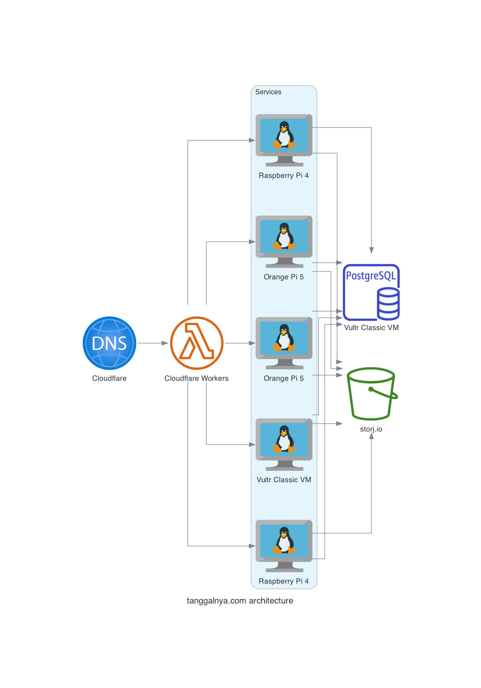
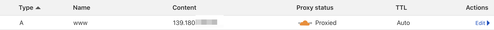
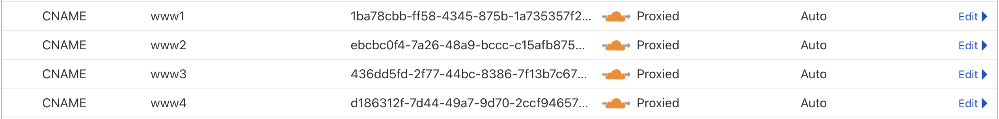
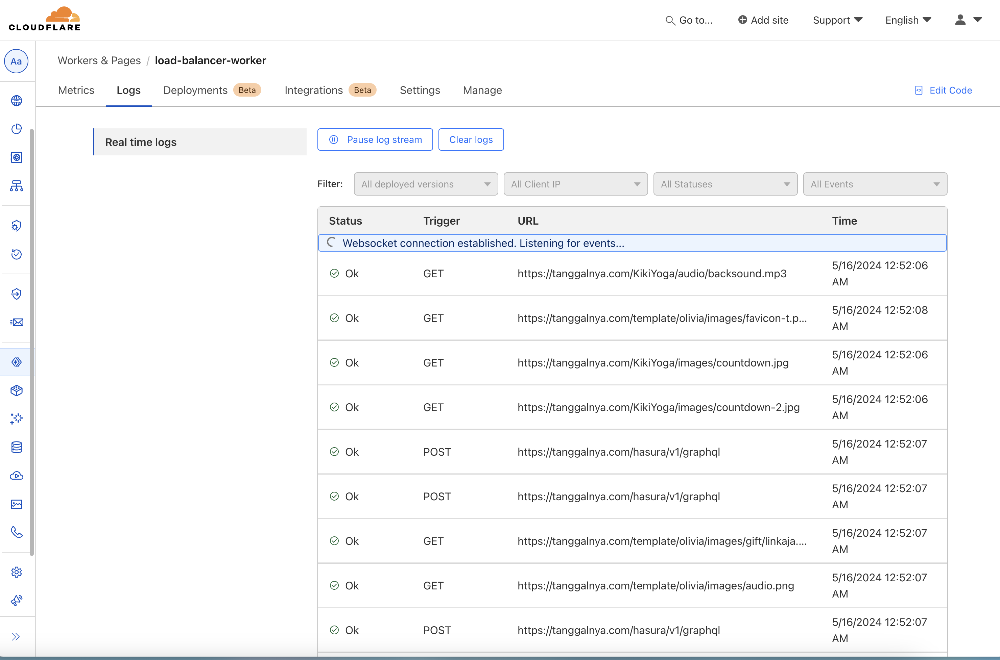
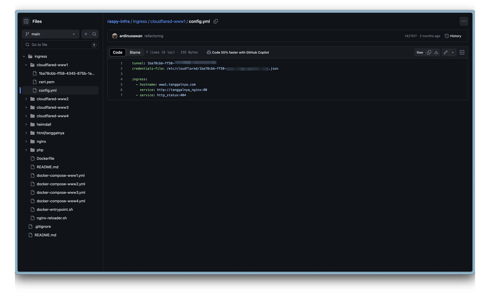
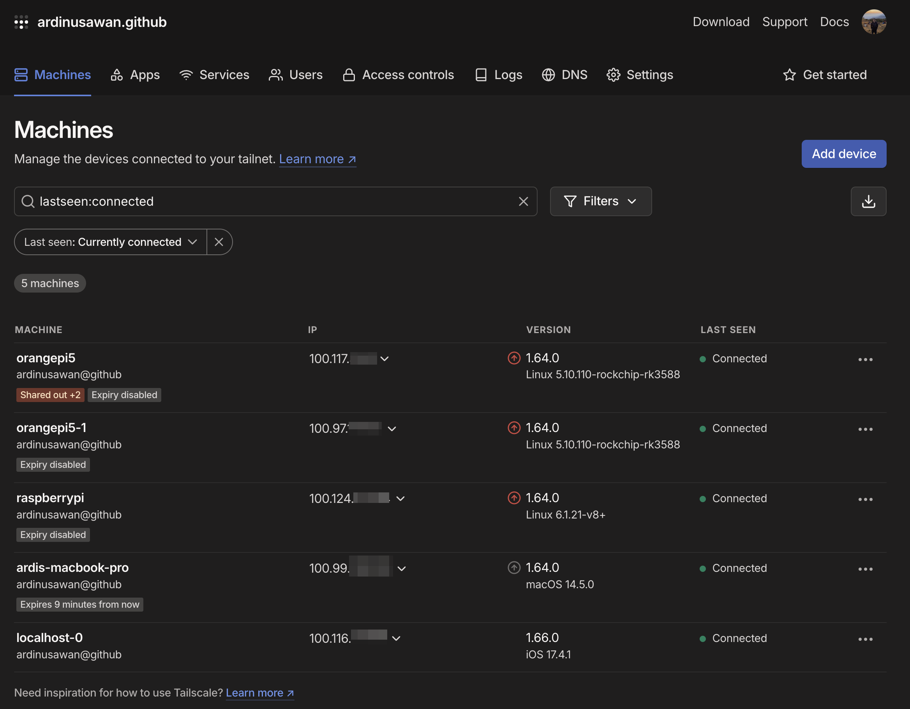

# Introduction

If you hit https://tanggalnya.com, your request will be routed to one of this domain
- https://www.tanggalnya.com
- https://www1.tanggalnya.com
- https://www2.tanggalnya.com
- https://www3.tanggalnya.com
- https://www4.tanggalnya.com

Except www, others is routed to my raspy / orange pi in my home. 

But, how come? How did I expose my raspy & orange pi to outside world?

# Architecture

Let's dig deeper in the architecture first

I do split ingress to 5 of machine
  - VM: www
  - Orange Pi 5: www1 & www2
  - Raspberry Pi 4: www3 & www4

Here the diagrams:


# Details

In 🚁 view, here the components:
1. DNS
2. Load Balancer
3. Services
4. Database
5. Storage

## DNS
Cloudflare is very powerfull DNS provider, here my A and CNAME record
  - 
  - 
      As you can see, for A record it just goes to IPv4 address (Vultr Classic VM). For CNAME, it goes to [cloudflared tunnel](https://github.com/cloudflare/cloudflared). This tunnel will expose port 80 of my pi to outside world.

Will keep my Vultr instance for a while until it stable (no complain from customer 😂)

When using dig, nothing from my pi is exposed
```
➜ dig www1.tanggalnya.com +noall +answer -t A

; <<>> DiG 9.10.6 <<>> www1.tanggalnya.com +noall +answer -t A
;; global options: +cmd
www1.tanggalnya.com.    678     IN      A       172.67.203.58
www1.tanggalnya.com.    678     IN      A       104.21.52.196

```

## Load Balancer

I do use Cloudflare Worker for LB. [Cloudflare Worker](https://workers.cloudflare.com/) is serverless function (just like AWS Lambda). Here the [source code](https://github.com/tanggalnya/load-balancer-worker/blob/main/src/proxy.ts) for round-robin the request. I build simple load balancer with health check enabled. Do check the code for details 🤓

Logs:


## Services

Before hitting my service, ingress is being handled by cloudflared first. Here the folder architecture and config


Cloudflared then route the request to nginx

My service is consist of monorepo of Nginx + PHP 🐘 + JS (FE) + [hasura.io](https://www.hasura.io) as GrapqhQL API Server. Nothing much I can say

For accessing my server, I use [tailscale](https://tailscale.com). Tailscale builds on top of WireGuard by adding automatic mesh configuration, single sign-on (SSO), NAT traversal, TCP transport, and centralized Access Control Lists (ACLs). The best of it? It free up to Up to 100 devices!

After connect to tailscale, then ssh to the internal ip


## Database

Postgres. For now it just single node 😎, obviously SPOF (single point of failure) is here 😢

In the future will build my own cluster DB using [patroni](https://github.com/zalando/patroni) hosted obviously in raspy/orange pi.

## Storage

For storing asset we choose storj.io, but plan to migrate to [Cloudflare R2](https://www.cloudflare.com/developer-platform/r2/) in the future (free egress ftw).

For image cache & resize service, we do use [wsrv](http://wsrv.nl/)

# Caveat

- THIS MAIN PROJECT PURPOSE IS TO REDUCE COST AS A BOOTSTRAPPED FOUNDER 🤣
- Cloudflare Worker is good enough if your traffic is low, but if you need more then better to use [Argo Smart Routing](https://developers.cloudflare.com/argo-smart-routing/) for load balancer in DNS level (A record)
- No auto recovery 😢. But since wrangler is already have health check, if 1 node goes down no traffic will be given

# Closing

Have any question? Wanna discuss? Hit me up on ardi.nusawan13[at]gmail.com!
